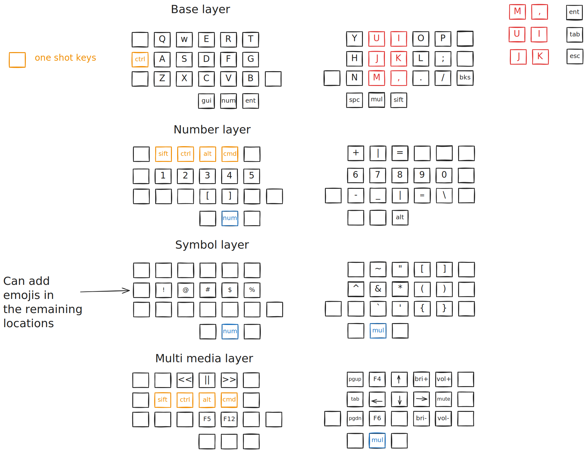

keymap -> 

The above keymap should be a self sufficient explanantion of the keymap, below are my thoughts on this version of the keymap

main goal of this layout is to move the effort from left side to the right side
The layout is intentionally as asymmentric and favoured towards right side as possible, in the context of keys which are to be held, since my hands are not symmentric in how they get things done so doesnt make sense the keyboard layout should be symmentric

space is used by the dominant thumb key, instead of on the left thumb key 

removed most of the one shot mods from the previous versions -> when possible would like to try callums one shot mods, for now I would like to get hang of this layout

shift key is moved to the dominant thumb key so that it can be used for both sides

in numbers layer alt key is added since I use that key for the purpose of moving between workspaces with alt + num, since shift key is not needed in the numbers layer, it is replaced with the alt key

mapped esc to j, k key as a combo, it was better than I expected, there is some muscle memory which still takes me to using the left pinky but using j,k feels good

Unintended consequence of moving to tab to number layer was autocomplete is more comfy&fun on this layer, using ring finger compared using on the left pinkie

Working on this keymap feels like I made a mistake jumping into 40% keyboard rabbit hole (╯°□°)╯︵ ┻━┻

Nevertheless, it was fun thinking throught this layout, though it felt like white board mastrubation after I came up with the layout, like primeagen describes when talking about architectural designs, There are many other things I could be improving upon rather than the keymap on a freaking keyboard, like the Ben horowitz author of "The hard thing about hard things" says you should work on developing lead bullets to beat the competetion, rather than thinking about silver bullets

Also me 

Next steps
- The overarching goal would be to try to minimie the usage of the extreme pinkie colums, decreasing the keys through combos or tab hold
- I would like to see if it is possible for me to move the position of enter, to the position of resting location of ;, so that I can use the enter thumb key for the purpose of symbol layer, though may be I should try tap mod first before comitting to this.
    - the issue I could think of using this right now is that, in vim : is used frequently to enter commands so easy access would be helpful, though this could be done through layers, current symbols configuration doesnt seems to working well with it
- Setup window manager keys so that in multi media layer the modifier keys are redundant, for now the modifier are placed for the purpose of moving the windows with modfiers, this is not directly related to this keymap
- all the symbols present in the num layer are for the purpose of workspace management, so that they can be used together with modfiers, thinking this through would be a good idea, on how to do workspace management keys
- I would like if I could include an emoticon layer, I think with the current capabilites of mine it is certainly pushing it
- similar to tab it would be good if I can keep the enter key on layer which is easily accessible via a thumb, as mentioned in the point 2

references used for building this keyboard
https://github.com/ghostbuster91/blogposts/blob/main/42-keys/main.md

https://johnlindquist.com/an-opinionated-guide-to-keyboard-thumb-keys/

http://www.keyboard-layout-editor.com/#/gists/016b11b6fc11fa1cb9306338a26e71f9

http://xahlee.info/kbd/banish_key_chords.html -> this was the main inspiration for using sticky keys or one shot mods, I wanted to use chording which feels good compared to just pressing all the keys together, his other posts are also insightful on ergonomics

https://github.com/callum-oakley/qmk_firmware/tree/master/users/callum -> callums one shot mods, which donot think about timing issues which come with using home row mods, or qmk's one shot mods, though currently there is no support from zmk on this ʕ ಡ ﹏ ಡ ʔ

People blogging about 34 key layout, make it feel like it is simple to use, but when implementing that layout but damn it feels difficult to get it right when trying to use it, it feels like they are intentionally saying it as easy to get more company in their misery

https://www.rousette.org.uk/archives/ferris-sweep-keyboard-and-layout/
https://www.jonashietala.se/blog/2021/06/03/the-t-34-keyboard-layout/
https://ryan.himmelwright.net/post/building-34-key-layout/

Like I said, you can go to the moon without a computer, so, you know, the thing we are talking about is 40% keyboard, which means only 40 keys. It's very hard to type Chinese, Japanse, Russian with 40% keyboard. It's like doubling your work. Yeah, you can. But if you need to type that two hours a day you gonna see a doctor within a month. (Xah Lee) -- Jorne wiki  https://github.com/joric/jorne/wiki

jokes aside it was fun reading through the posts of users who are ahead in the keyboard, and their other posts related to other aspects of optimisation was fun too
